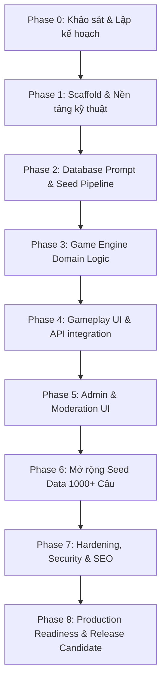

# KẾ HOẠCH TRIỂN KHAI (IMPLEMENTATION PLAN)
## Dự án: Website Game "TRUTH OR DARE - Thật Hay Thách" bằng tiếng Việt

---

## 📌 TỔNG QUAN PHÂN CHIA PHASE

---

## 🚀 CHI TIẾT TỪNG PHASE & CHECKLIST

### Phase 0: Khảo sát & Lập kế hoạch (ĐANG THỰC HIỆN)
- [x] Đọc file `ANTIGRAVITY_PLAN_TRUTH_OR_DARE_VI.md`.
- [x] Kiểm tra toolchain local (Node.js 22, npm, npx pnpm, Docker check).
- [x] Tạo `docs/DECISIONS.md`.
- [x] Tạo `docs/IMPLEMENTATION_PLAN.md`.
- [ ] Xác nhận với người dùng/hệ thống và sẵn sàng khởi chạy Phase 1.

---

### Phase 1: Scaffold Dự án & Setup Nền Tảng Kỹ Thuật
- **Mục tiêu:** Tạo codebase Next.js App Router + TypeScript, Tailwind CSS, ESLint/Prettier, Vitest, Playwright, Prisma ORM schema ban đầu và Docker Compose config.
- **Tasks:**
  1. Scaffold ứng dụng Next.js (App Router, TS, Tailwind CSS) bằng npm/pnpm.
  2. Cấu hình ESLint, Prettier, TypeScript `tsconfig.json` chặt chẽ.
  3. Thiết lập Vitest cho Unit test và Playwright cho E2E test.
  4. Cấu hình Prisma ORM schema với các models: `Prompt`, `Category`, `Audience`, `PromptCategory`, `PromptAudience`, `GameSession`, `Player`, `GameTurn`, `PromptReport`.
  5. Tạo `.env.example`, `docker-compose.yml`, `README.md`.
  6. Xây dựng Design Tokens & Root Layout tiếng Việt responsive (Mobile-first, Google Font Inter/Outfit, Dark/Vibrant UI).
- **Acceptance Criteria:**
  - `pnpm dev` (hoặc `npm run dev`) khởi chạy thành công.
  - `pnpm lint`, `pnpm typecheck`, `pnpm test`, `pnpm build` đều pass không có lỗi.
  - Landing page skeleton hiển thị đẹp trên điện thoại và máy tính.

---

### Phase 2: Database Prompt, Seed Pipeline & Validation
- **Mục tiêu:** Xây dựng module quản lý prompt, logic normalize văn bản tiếng Việt, chống trùng lặp (deduplication) và pipeline seed dữ liệu.
- **Tasks:**
  1. Xây dựng utility `normalizeVietnamesePrompt` (xử lý khoảng trắng, lowercase, ký tự đặc biệt nhưng giữ nguyên dấu tiếng Việt).
  2. Xây dựng module kiểm tra trùng lặp exact & near-duplicate (Jaccard / Levenshtein similarity).
  3. Tạo schema Zod validate seed data & CSV/JSON import format.
  4. Viết script `prisma/seed.ts` idempotency cho categories, audiences và seed tối thiểu 100 câu Truth + 100 câu Dare mẫu chuẩn tiếng Việt.
  5. Viết unit test kiểm thử pipeline seed, validation và normalization.
- **Acceptance Criteria:**
  - Seed script chạy không lỗi, không tạo trùng khi rerun.
  - Tất cả prompt seed đều gán đúng taxonomy, age, difficulty và safety flags.
  - Test suite cho normalization & deduplication đạt 100% pass.

---

### Phase 3: Game Engine Domain Logic & Pure Logic Testing
- **Mục tiêu:** Triển khai core game engine hoàn toàn độc lập với UI, bao gồm chọn người chơi (Round-robin, Balanced Random), chọn câu ngẫu nhiên có trọng số (Weighted Random selection), quản lý lượt và tính điểm.
- **Tasks:**
  1. Module quản lý danh sách người chơi (Validation 2–10 người, chống tên rỗng/trùng, shuffle order).
  2. Implement `SelectionMode`: Round-robin (lần lượt) & Balanced Random (tránh chọn 1 người liên tiếp, cân bằng lượt).
  3. Implement `PromptSelectionEngine`: Hard filtering (Status=PUBLISHED, language=vi, age <= session age, difficulty, safety flags, exclude used IDs in session) + Soft ranking (quality score, low times served, diversity) + Safe Fallback.
  4. Implement `GameTurnState`: Transitions (PRESENTED -> COMPLETED / SKIPPED / REPLACED / REFUSED).
  5. Implement `ScoringSystem` (+1 Truth, +2 Dare, 0 Skip/Refuse, No negative points).
  6. Viết bộ Unit test coverage cao cho toàn bộ Game Engine.
- **Acceptance Criteria:**
  - Game Engine chạy đúng 100% qua các kịch bản test (tránh lặp câu, tuân thủ bộ lọc an toàn, tính lượt/điểm chính xác).
  - Không vi phạm nguyên tắc an toàn khi pool cạn.

---

### Phase 4: Frontend Gameplay & End-to-End API Integration
- **Mục tiêu:** Xây dựng giao diện chơi game mượt mà trên mobile/desktop và tích hợp toàn bộ API/Server Actions.
- **Tasks:**
  1. Landing Page: Hero section, CTA "Chơi ngay", 3 bước hướng dẫn, tính năng, an toàn & quy tắc.
  2. Setup Page: Nhập danh sách 2–10 người chơi, xáo trộn, chọn bộ lọc (tuổi, mức độ, loại nhóm, cờ an toàn), bắt đầu game.
  3. Game Play Page: Header (lượt, tên người chơi), nút chọn THẬT / THÁCH, màn hình hiển thị câu hỏi (card hiệu ứng đẹp, badge chủ đề/độ khó), các nút thao tác (Hoàn thành, Đổi câu, Bỏ lượt, Báo cáo câu hỏi).
  4. Game Transition & Summary Page: Chuyển lượt với hiệu ứng nhẹ, trang kết quả phiên chơi (tổng điểm, thống kê, danh hiệu vui như "Dũng cảm nhất", "Thành thật nhất", nút chơi lại).
  5. Tích hợp Route Handlers / Server Actions với Server State (PostgreSQL persistence).
  6. Viết E2E tests bằng Playwright cho toàn bộ luồng chơi từ Landing -> Setup -> Gameplay -> Results.
- **Acceptance Criteria:**
  - Người dùng chơi tốt end-to-end trên mobile 320px+ và desktop.
  - Refresh trang không làm mất trạng thái phiên chơi.
  - Playwright E2E tests pass 100%.

---

### Phase 5: Trang Quản trị (Admin Dashboard) & Moderation
- **Mục tiêu:** Xây dựng giao diện Admin an toàn để quản lý, tìm kiếm, lọc, duyệt, import/export và xử lý report câu hỏi.
- **Tasks:**
  1. Admin Authentication (Xác minh session/cookie HTTP-only, bảo vệ route `/admin`).
  2. Prompt CRUD Dashboard: Bảng danh sách prompt hỗ trợ search, filter theo type/status/age/difficulty, pagination, sorting.
  3. Form Tạo/Sửa Prompt với Preview hiển thị giao diện Card mobile.
  4. Import Wizard: Tải file CSV/JSON, thực hiện Dry-run preview (báo cáo hợp lệ, trùng exact/near, lỗi), commit vào DB trong transaction.
  5. Export Prompt ra file JSON/CSV.
  6. Report Moderation Queue: Xem các báo cáo từ người chơi, thay đổi trạng thái (Resolve, Dismiss, Archive prompt).
  7. API Integration tests cho toàn bộ luồng Admin.
- **Acceptance Criteria:**
  - Người dùng không có quyền admin bị chặn truy cập 403/Redirect.
  - Import dry-run báo cáo lỗi chính xác trước khi lưu vào DB.
  - Chức năng CRUD và Moderation hoạt động trơn tru.

---

### Phase 6: Mở rộng Seed Data Chất lượng Cao (1,000+ Câu)
- **Mục tiêu:** Mở rộng cơ sở dữ liệu câu hỏi tiếng Việt lên tối thiểu 500 câu Truth + 500 câu Dare chuẩn mực, phân bổ hợp lý theo ma trận taxonomy.
- **Tasks:**
  1. Xây dựng dataset 500+ Truth và 500+ Dare tiếng Việt tự nhiên, phù hợp văn hóa Việt Nam.
  2. Chạy pipeline validate, normalize và exact/near deduplication.
  3. Gán đầy đủ metadata (MinimumAge, Difficulty, Audiences, Categories, Safety Flags).
  4. Thâm nhập DB qua seed script idempotent.
  5. Kiểm tra độ phủ (Coverage report) theo ma trận taxonomy và age group.
- **Acceptance Criteria:**
  - Không có câu hỏi trùng lặp chính xác.
  - 100% câu hỏi ở trạng thái `PUBLISHED` tuân thủ Content Policy (không bạo lực, tình dục, làm nhục, vi phạm pháp luật).

---

### Phase 7: Hardening, Security, SEO & Privacy Pages
- **Mục tiêu:** Gia cố an ninh hệ thống, tối ưu hiệu năng, thêm trang pháp lý/hướng dẫn và SEO.
- **Tasks:**
  1. Thêm Security Headers (CSP, X-Content-Type-Options, Referrer-Policy, HSTS).
  2. Thêm Rate Limiting cho API tạo session, report và admin login.
  3. Viết các trang static: Trang Hướng dẫn (`/guide`), Quy tắc an toàn (`/safety`), Chính sách riêng tư (`/privacy`).
  4. SEO metadata (Title, Description tiếng Việt, OpenGraph image, Sitemap, Robots.txt).
  5. Tối ưu contrast WCAG AA, aria-live, keyboard navigation.
- **Acceptance Criteria:**
  - Bảo mật đạt tiêu chuẩn, không lộ stacktrace hay PII.
  - Các trang SEO và pháp lý hoàn thiện.

---

### Phase 8: Verification, Production Readiness & Release
- **Mục tiêu:** Chạy toàn bộ kiểm thử tích hợp, kiểm tra build production và lập báo cáo bàn giao.
- **Tasks:**
  1. Chạy full suite: `lint`, `typecheck`, `test:unit`, `test:integration`, `test:e2e`, `build`.
  2. Khởi chạy ứng dụng production mode (`pnpm start`) và kiểm tra bằng trình duyệt.
  3. Cập nhật `README.md` với đầy đủ hướng dẫn chạy local, seed, test, build, deploy.
  4. Ghi lại kết quả test và bằng chứng nghiệm thu.
- **Acceptance Criteria:**
  - Mọi lệnh kiểm tra đều xanh (pass).
  - Web chạy ổn định, responsive, không có bug blocker.

---
